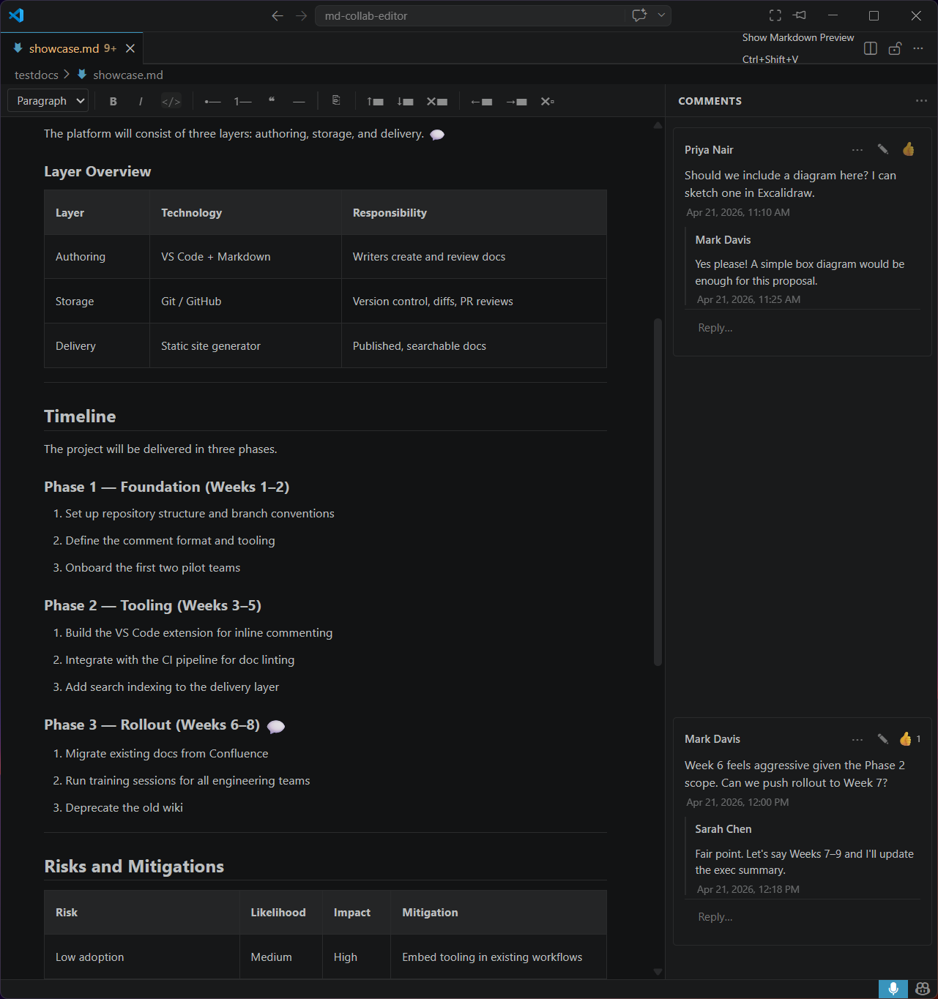
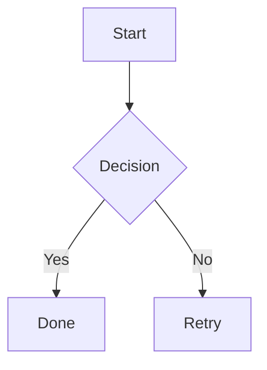

# Markdown Collaboration Editor

A VS Code extension that brings Word-style inline commenting and WYSIWYG editing to Markdown files — comments are stored directly inside the `.md` file as invisible HTML comments, so they travel with the document through git.



## Features

* **WYSIWYG editing** — Milkdown-powered rich text editor renders Markdown in-place

* **Formatting toolbar** — apply headings (H1–H4), bold, italic, inline code, bullet list, numbered list, blockquote, horizontal rule, and insert tables — all without writing Markdown syntax

* **Table editing** — context-sensitive toolbar appears when your cursor is inside a table: add/delete rows and columns above, below, left, or right of the cursor

* **Mermaid diagrams** — fenced ` ```mermaid ``` ` code blocks are rendered as live diagrams; raw syntax is preserved on disk

* **Local Markdown links** — clicking a relative `.md` link opens the target file in a new Collaboration Editor tab

* **Inline comments** — comments are anchored to text and stored as `<!-- COMMENT {...} -->` tags inside the file; invisible to Markdown renderers, visible in the panel

* **Threaded replies** — reply to any comment thread

* **Resolve threads** — mark threads resolved (Word-style); toggle visibility of resolved comments

* **Likes** — like comments and replies

* **Bulk actions** — resolve all or delete all comments at once

* **Author detection** — author name and email are read from `git config`; override in settings

* **Keyboard shortcut** — `Ctrl+Shift+;` (macOS: `Cmd+Shift+;`) to add a comment at the cursor

* **Explorer context menu** — right-click any `.md` file and choose **Open with Collaboration Editor**

## Usage

Open any `.md` file and switch the editor to **Markdown Collaboration Editor** via the editor-picker dropdown (top-right of the editor tab), or right-click the file in the Explorer and choose **Open with Collaboration Editor**.

### Formatting toolbar

The toolbar sits at the top of the editor. Use the **block type dropdown** to switch between Paragraph and Headings 1–4. The **B**, *I*, and `</>` buttons toggle bold, italic, and inline code on selected text and reflect the active formatting as you move the cursor.

When your cursor is inside a table, additional table-editing buttons appear:

| Button | Action |
|--------|--------|
| ↑▬ | Add row above |
| ↓▬ | Add row below |
| ✖▬ | Delete current row |
| ←▬ | Add column to the left |
| →▬ | Add column to the right |
| ✖▮ | Delete current column |

### Mermaid diagrams

Write a fenced code block with the `mermaid` language tag:

````markdown

````

The diagram renders automatically in the editor. The raw `mermaid` source is what gets saved to disk.

### Adding a comment

1. Select text in the editor
2. Press `Ctrl+Shift+;` (macOS: `Cmd+Shift+;`), or right-click and choose **Add Comment**, or run **Markdown Collaboration Editor: Add Comment** from the Command Palette
3. Type your comment and press **Save**

### Replying and resolving

* Click a comment card to expand it and write a reply

* Use the `...` menu on a comment card to **Edit**, **Resolve**, or **Delete** a thread

## Comment Storage Format

Comments are stored inline in the Markdown file as HTML comments and are never visible in rendered output:

```markdown
Some text<!-- COMMENT {"id":"a1b2c3","author":"Jane Doe","body":"Please expand this.","date":"2026-04-20T10:00:00.000Z"} -->
```

Replies and likes are stored in the same JSON payload. The format is git-friendly — comments diff and merge naturally alongside prose.

## Settings

| Setting | Default | Description |
|---------|---------|-------------|
| `mdCollabEditor.authorName` | `""` | Override the author name for new comments (defaults to `git user.name`) |
| `mdCollabEditor.authorEmail` | `""` | Override the author email (defaults to `git user.email`) |
| `mdCollabEditor.showResolvedComments` | `false` | Show resolved comment threads in the panel |

## Commands

| Command | Shortcut | Description |
|---------|----------|-------------|
| Markdown Collaboration Editor: Add Comment | `Ctrl+Shift+;` | Add a comment at the current selection |
| Markdown Collaboration Editor: Toggle Resolved Comments | — | Show/hide resolved threads |
| Markdown Collaboration Editor: Open with Collaboration Editor | — | Open a Markdown file in this editor (also available in Explorer context menu) |

## Requirements

* VS Code 1.85 or later

* Git installed (for author detection)

## License

MIT
